# Автор: Федорчук Дмитрий Сергеевич DEVOPS-33

# Домашнее задание к занятию «Основы Terraform. Yandex Cloud»

### Задание 0

1. Ознакомьтесь с [документацией к security-groups в Yandex Cloud](https://cloud.yandex.ru/docs/vpc/concepts/security-groups?from=int-console-help-center-or-nav).
2. Запросите preview-доступ к этому функционалу в личном кабинете Yandex Cloud. Обычно его выдают в течение 24-х часов.
https://console.cloud.yandex.ru/folders/<ваш cloud_id>/vpc/security-groups.   
Этот функционал понадобится к следующей лекции. 


### Задание 1
В качестве ответа всегда полностью прикладывайте ваш terraform-код в git.

1. Изучите проект. В файле variables.tf объявлены переменные для Yandex provider.
2. Переименуйте файл personal.auto.tfvars_example в personal.auto.tfvars. Заполните переменные: идентификаторы облака, токен доступа. Благодаря .gitignore этот файл не попадёт в публичный репозиторий. **Вы можете выбрать иной способ безопасно передать секретные данные в terraform.**
3. Сгенерируйте или используйте свой текущий ssh-ключ. Запишите его открытую часть в переменную **vms_ssh_root_key**.
4. Инициализируйте проект, выполните код. Исправьте намеренно допущенные синтаксические ошибки. Ищите внимательно, посимвольно. Ответьте, в чём заключается их суть.
5. Ответьте, как в процессе обучения могут пригодиться параметры ```preemptible = true``` и ```core_fraction=5``` в параметрах ВМ. Ответ в документации Yandex Cloud.

В качестве решения приложите:

- скриншот ЛК Yandex Cloud с созданной ВМ;
- скриншот успешного подключения к консоли ВМ через ssh. К OS ubuntu необходимо подключаться под пользователем ubuntu: "ssh ubuntu@vm_ip_address";
- ответы на вопросы.

### Решение 1

1. Изучил проект, посмотрел variables.tf. Файл variables.tf нужен для того, чтобы определить типы переменных и при необходимости, установить их значения по умолчанию.

2. Переименовал файл personal.auto.tfvars_example в personal.auto.tfvars, заполнил переменные. Поскольку файл personal.auto.tfvars находится в .gitignore, то можно не опасаться утечки данных. Передавать секретные переменные можно и другими способами. Например, в секретной переменной можно указать ключ sensitive = true, тогда при выполнении ```terraform plan/apply/output/console``` его значение не будет выведено в консоль.

Также можно передавать секретные переменные в командной строке в ключе -var - ```terraform apply -var "token=***"```, использовать переменные окружения, предварительно их создав, например, командой export token=***, либо при выполнении ```terraform apply``` ссылаться на отдельный var файл вне рабочей директории проекта - ```terraform apply -var-file=~/.secret/private.tfvars```.

3. Создал короткий ssh ключ используя ```ssh-keygen -t ed25519```, записал его pub часть в переменную ***vms_ssh_root_key***.

4. Инициализировал проект, выполнил код. Нашел ошибки в блоке ***resource "yandex_compute_instance" "platform" {***.

Ошибки были следующие:

* В строке ***platform_id = "standart-v4"*** должно быть слово standard
* Версия v4 неправильная. Согласно документации Yandex.Cloud (https://cloud.yandex.ru/docs/compute/concepts/vm-platforms) платформы могут быть только v1, v2 и v3.
* В строке ***cores         = 1*** указано неправильное количество ядер процессора. Согласно документации Yandex.Cloud (https://cloud.yandex.ru/docs/compute/concepts/performance-levels) минимальное количество виртуальных ядер процессора для всех платформ равно двум.

После исправления ошибок удалось запустить код и создать виртуальную машину.

Исправленный блок ресурса выглядит следующим образом:

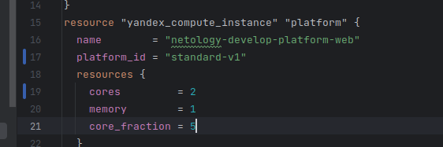

5. Параметр ```preemptible = true``` применяется в том случае, если нужно сделать виртуальную машину прерываемой, то есть возможность остановки ВМ в любой момент. Применятся если с момента запуска машины прошло 24 часа либо возникает нехватка ресурсов для запуска ВМ. Прерываемые ВМ не обеспечивают отказоустойчивость.

Параметр ```core_fraction=5``` указывает базовую производительность ядра в процентах. Указывается для экономии ресурсов.

Виртуальная машина успешно создана:

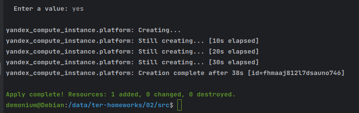

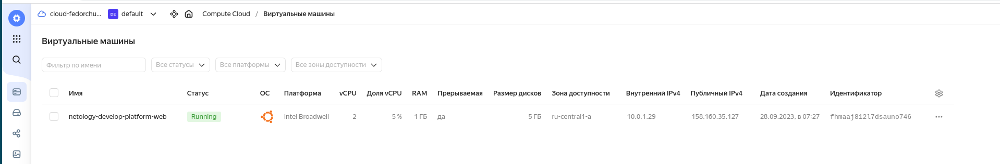

Подключение по протоколу SSH работает:

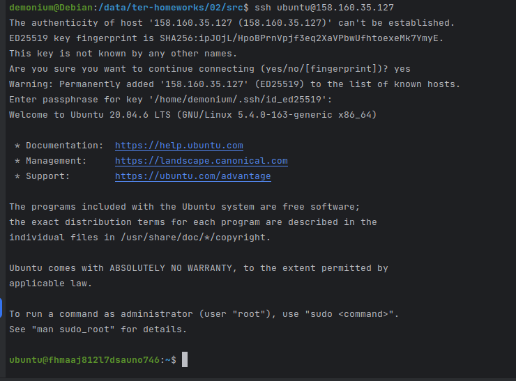

### Задание 2

1. Изучите файлы проекта.
2. Замените все хардкод-**значения** для ресурсов **yandex_compute_image** и **yandex_compute_instance** на **отдельные** переменные. К названиям переменных ВМ добавьте в начало префикс **vm_web_** .  Пример: **vm_web_name**.
2. Объявите нужные переменные в файле variables.tf, обязательно указывайте тип переменной. Заполните их **default** прежними значениями из main.tf. 
3. Проверьте terraform plan. Изменений быть не должно.

### Решение 2

1. Изучил файлы проекта. Проект разбит на отдельные файлы, описывающие ядро проекта, сетевую часть, описание общих переменных, блок провайдера, блок вывода информации.

2. Заменил хардкод-значения для ресурсов yandex_compute_image и yandex_compute_instance с добавлением префикса ***vm_web_***:

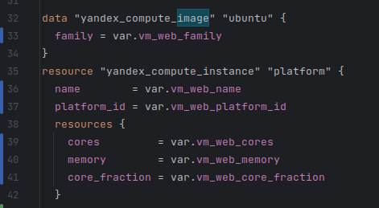

3. Объявил переменные в файле variables.tf:

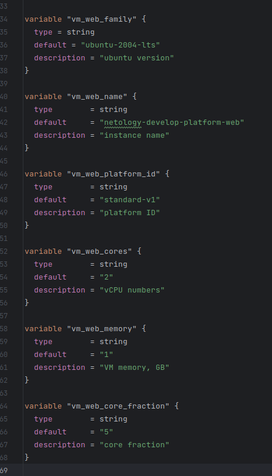

4. Выполнил ```terraform plan```, появилось сообщение о том, что terraform не нашел отличий от действующей инфраструктуры:

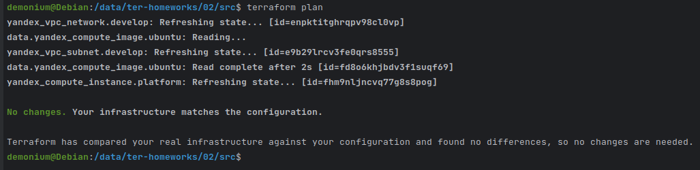

### Задание 3

1. Создайте в корне проекта файл 'vms_platform.tf'. Перенесите в него все переменные первой ВМ.
2. Скопируйте блок ресурса и создайте с его помощью вторую ВМ в файле main.tf: **"netology-develop-platform-db"** ,  cores  = 2, memory = 2, core_fraction = 20. Объявите её переменные с префиксом **vm_db_** в том же файле ('vms_platform.tf').
3. Примените изменения.

### Решение 3

1. Создал в корне проекта файл 'vms_platform.tf'. Перенес в него все переменные первой ВМ:

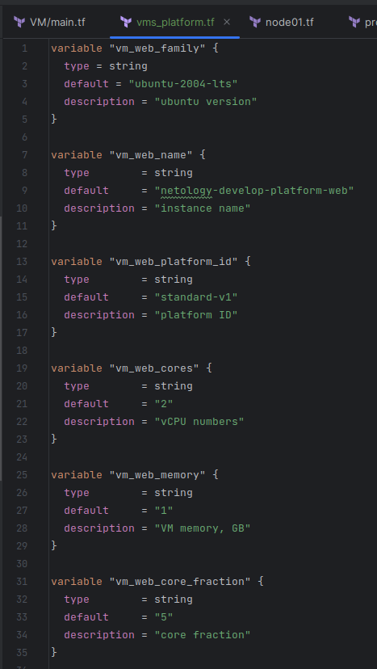

2. В блоке ресурса создал вторую ВМ с указанными параметрами и объявил её переменные с префиксом ***vm_db_*** в файле vms_platform.tf:

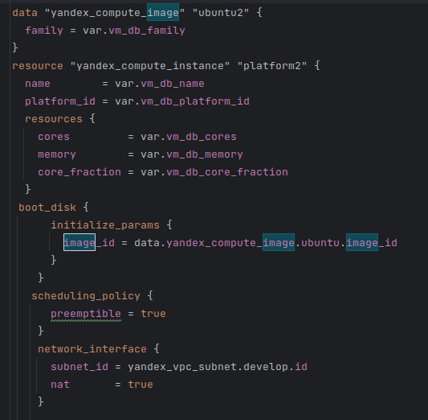

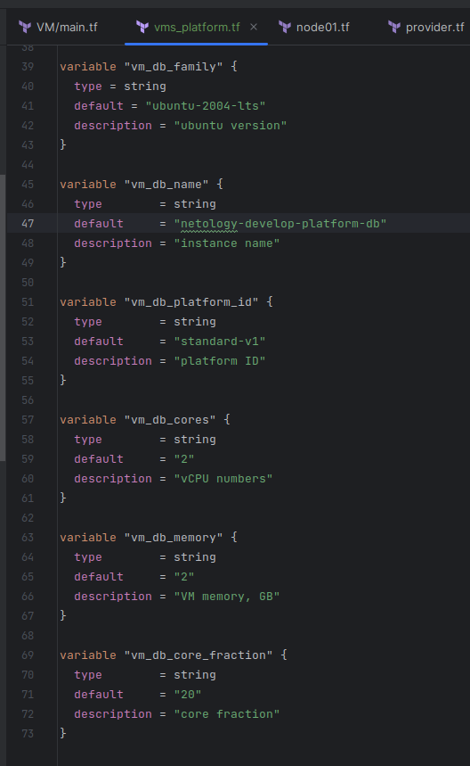

3. Применяю конфигурацию, вносится изменение в текущую инфраструктуру, создается еще одна виртуальная машина:

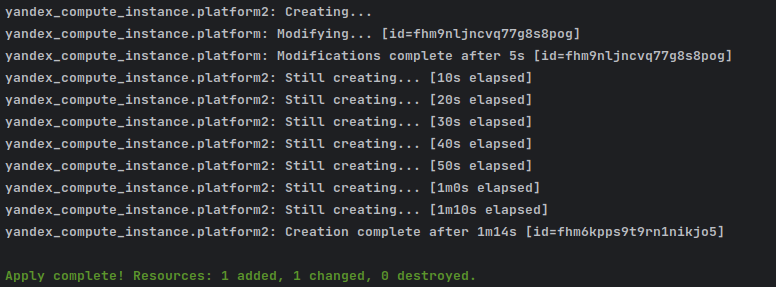

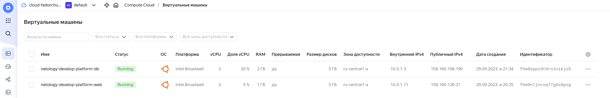

### Задание 4

1. Объявите в файле outputs.tf output типа map, содержащий { instance_name = external_ip } для каждой из ВМ.
2. Примените изменения.

В качестве решения приложите вывод значений ip-адресов команды ```terraform output```.

### Решение 4

1. Объявил в outputs.tf output типа map, получился следующий output:

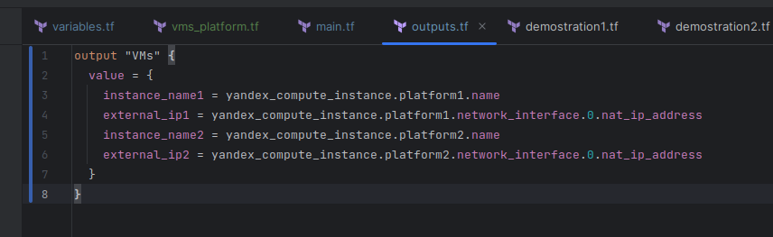

2. Применил изменения,  ```terraform output``` показал следующее:

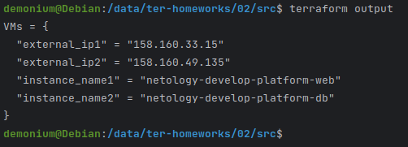

### Задание 5

1. В файле locals.tf опишите в **одном** local-блоке имя каждой ВМ, используйте интерполяцию ${..} с несколькими переменными по примеру из лекции.
2. Замените переменные с именами ВМ из файла variables.tf на созданные вами local-переменные.
3. Примените изменения.

### Решение 5

1. В файле locals.tf применил интерполяцию, в одном блоке описал имена ВМ:

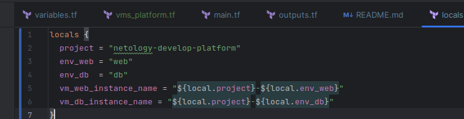

2. Закомментировал старые variables с именами, в main сослался на созданный local:


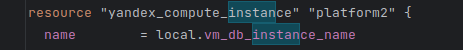

3. Применил изменения.

### Задание 6

1. Вместо использования трёх переменных  ".._cores",".._memory",".._core_fraction" в блоке  resources {...}, объедините их в переменные типа **map** с именами "vm_web_resources" и "vm_db_resources". В качестве продвинутой практики попробуйте создать одну map-переменную **vms_resources** и уже внутри неё конфиги обеих ВМ — вложенный map.
2. Также поступите с блоком **metadata {serial-port-enable, ssh-keys}**, эта переменная должна быть общая для всех ваших ВМ.
3. Найдите и удалите все более не используемые переменные проекта.
4. Проверьте terraform plan. Изменений быть не должно.

### Решение 6

1. Описываю переменные ".._cores",".._memory",".._core_fraction" в vms_platform.tf:

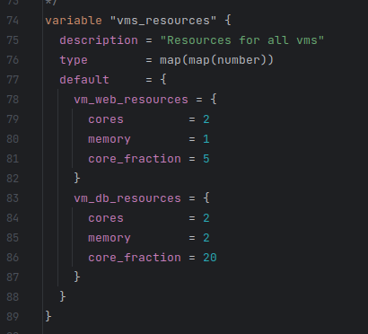

В main.tf в блоке resources применяю описанные выше переменные:

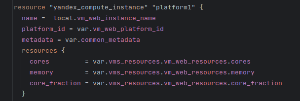

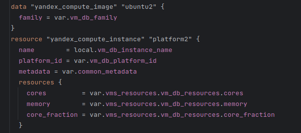

2. Для блока metadata описываю переменные:

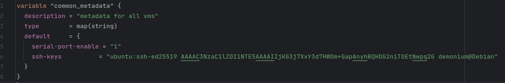

В main.tf в блоке resources применяю описанные выше переменные:

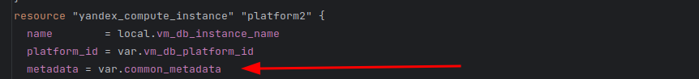

3. Нашел и удалил неиспользуемые переменные.

4. Команда ```terraform plan``` изменение не выявила:

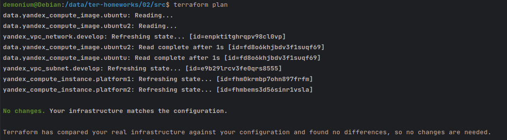

------

### Задание 7*

Изучите содержимое файла console.tf. Откройте terraform console, выполните следующие задания: 

1. Напишите, какой командой можно отобразить **второй** элемент списка test_list.
2. Найдите длину списка test_list с помощью функции length(<имя переменной>).
3. Напишите, какой командой можно отобразить значение ключа admin из map test_map.
4. Напишите interpolation-выражение, результатом которого будет: "John is admin for production server based on OS ubuntu-20-04 with X vcpu, Y ram and Z virtual disks", используйте данные из переменных test_list, test_map, servers и функцию length() для подстановки значений.


1. Поскольку нумерация идем со значения 0, то второй элемент можно отобразить командой ```local.test_list[1]```:

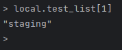

2. Длину списка test_list можно узнать командой ```length(["develop", "staging", "production"])```. Длина списка равна 3:

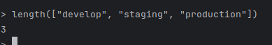

3. Отобразить значение ключа admin из map test_map можно командой ```local.test_map["admin"]```:

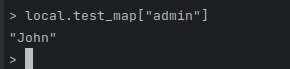

4. Для выполнения этого пункта я написал в output такое выражение:

output "admin_server_info" {
  value = "${local.test_map.admin} is admin for ${local.test_list[length(local.test_list)-1]} server based on OS ${local.servers[local.test_list[length(local.test_list)-1]]["image"]} with ${local.servers[local.test_list[length(local.test_list)-1]]["cpu"]} vcpu, ${local.servers[local.test_list[length(local.test_list)-1]]["ram"]} ram, and ${local.servers.production["disks"][0]}, ${local.servers.production["disks"][1]}, ${local.servers.production["disks"][2]}, ${local.servers.production["disks"][3]} virtual disks."
}

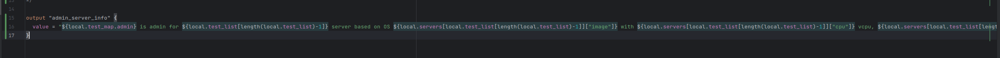

Команда ```terraform output``` выводит нужный текст:


------
